Markdown syntax: https://www.markdownguide.org/cheat-sheet/ 

# **FP4 \- Final Project Writeup - Kevin Xu**

## Part 1: Website Description

Describe your website (300 words).

* What is the purpose of your website? 

The purpose of my website was to create a way of showcasing my personal work. I knew from the beginning that my work was meant to be the main focus, and the website should be designed around showcasing and guiding people through my work the best way possible, so it was a very fun experience thinking about usability, constraints, and how to best serve a specific purpose. 
* Who is the target audience?  

The target audience is a fellow designer who is looking for the "wow-factor". Recruiters in the design industry are familiar with portfolio formats, and I need to deliver on their expectations while still keeping things refreshing and interesting. I wanted to utilize animation libraries to increase interactivity, and include intuitive features that make the whole experience feel seamless and amooth for them. 
* What information do you convey with your website?   

There is a hierarchy of information on my website. I want to prioritize images of my project, then the textual descriptions of the project. There are also separate pieces of information about myself in the about section, and I was intentional with the hierarchy present there. 
* How is it interesting and engaging?

-Horizontal scroll + parallax Effect: makes the website unique and fun to use in terms of navigating my works. 
-Consistent nav menu: with many novel features, the website needs consistency somewhere so that users can easily anchor themselves in the experience. This menu stays consistent so that in case anything goes wrong they can easily recover and get where they need to, and remain engaged in the whole experience.
-Animated text: adds a level of interactivity because it is activated by scroll and on page load. This gives a feeling of tactility and is also intriguing to watch. 
-Progress counter: useful information as users can know how far down in the page they are. Used in conjunction with the "back to top" arrow. 

## Part 2: User Interaction

How a user would interact with your website? For each step, briefly but clearly state the interaction type & how we should reproduce it.

1. Users scroll their mouse, trackpad, or press any arrow key to navigate my main menu.
2. Users click on a picture to view the project.
3. Users then scroll on their mouse, trackpad, or arrow key to navigate project page, seeing the progress on the bottom right. 
4. Once at the bottom of the project page, users click the ^ button to go back to top.
5. At any time, users can choose to go back to the navigation menu by clicking the website logo, or pressing "works" button. It will return them to the place they left off in the navigation menu, which is a subtle detail that makes the experience more seamless, so they don't have to scroll back to the next project. This is done through using localstorage. Users can also click "about" to view information about me.
6. In the about section, users can click the links to view my linkedin and resume. 

## Part 3: External Tool

Describe what important external tool you used (JavaScript library, Web API, animations, or other). Following the bulleted list format below, reply to each of the prompts.

1. Gsap and scrolltrigger
   * I chose to use this library because it is the most well-known animation library for web development, and although it is a bit more complex, it is customizable and I needed customizability for the unique parallax effect.
   * It is used to animate the track based on how far you scroll, and also animate the images accordingly at a different pace for parallax effect.
   * Ultimately, it adds engagement and delight to my website because the interaction is unique. It also keeps things simple and doesn't distract from my work. 
2. SplitText library
   * I chose to use this library because based on my research, it is the go-to for creating text animations that split line-by-line or character-by-character.
   * It is used to animate the project page and about page texts in my website. I configured the animation timing and also rate of change to find a balance between too much and too little movement. 
   * It adds interactivity because it is triggered when user scrolls the text into view. 

## Part 4: Design Iteration

Describe how you iterated on your prototypes, if at all, including any changes you made to your original design while you were implementing your website and the rationale for the changes. (4-8 sentences max)

There were a few changes I made to my original design: I included a image grid system to better present related images in my projects, I removed the click and drag to scroll for the main navigation page because users keep accidentally clicking into the images when they don't want to, and because the feature wasn't being used by users I tested the design on, and finally I replaced the scrollbar idea with a progress indicator because I want to encourage users reaching the bottom of the page (seeing all of my work) and using the back to top button instead of rapidly skipping through. 

## Part 5: Implementation Challenge

What challenges did you experience in implementing your website? (2-4 sentences max)

Biggest challenge I had to overcome was making the navigation horizontal scroll/parallax effect. I learned a lot of concepts not related to the class in trying to get this to work, and gathered a lot of web-develpment tools experience, and another major challenge was using media query and making the website work for a variety of screen sizes. I was able to accomplish this in the end, with careful use of "vw" and "vh" and "vmin" instead of the usual "%" and "px". 

## Part 6: Generative AI Use and Reflection

Describe how you used Generative AI tools to create this final project (a page max, \~500 words).

### ChatGPT Usage
* It matched my expectations and plan in [FP2](#generative-ai-use-plan) in that I didn't overly rely on chatGPT, instead using it to help me debug and come up with ideas for certain features. ChatGPT was knowledgable in compatiability issues and why certain things wouldn't work so it was very useful and informative when I had questions on why something wasn't working the way it's supposed to. 
* It did not match my expectations and plan in [FP2](#generative-ai-use-plan) in that I had to sometimes give it not just a section of my code but a lot of other related code just to make it understand the circumstances. Horizontal parallax is a uncommon feature and sometimes just the HTML or just the JS wasn't enough to help it understand what I was doing. 
* I critiqued/evaluated the generated suggestions before incorporation by not relying on generated suggestions but instead seeing what other web developers were doing and asking chatGPT for help implementing my ideas and debugging/explaining code I don't understand. 
* I accepted the generations when I could understand the reasoning behind the generations and I verified this is common practice online in documentations. This tool did not influence my final design and implementation plan because I always had a plan of what I wanted to make and my design was set in stone. 
* The pros and cons of using this Generative AI tool: pros include how knowledgable it is. ChatGPT has definitely come a long way and it gives debugging steps and suggestions with ease. Cons include there are definitely times where it had no idea what it was talking about and those generations obviously wouldn't work. I think that boils down to whether what you're doing is considered common or not. 

***Usage Experiences by Project Aspects***

| Ratings | design | plan | write code | debug | \_ (other?) |
| :---- | :---- | :---- | :---- | :---- | :---- |
| Usage1 | \[no\] because I am a designer | \[no\] because I like to make my own plan on what to make | \[yes] because in a few rare cases I asked it to help me come up with ideas on how to acheive something when I had no idea how. I used that as direction to find more resources online to create the code, making sure I'm figuring it out myself.  | \[yes\] because I actually used the debugging of ChatGPT a lot, javascript often does not let you know where the error is and ChatGPT saved me a lot of time in helping me find the errors. | \[yes/no\] because … |
| Reduce/Improve Productivity2 | \[N/A\] because I didn't use AI | \[N/A\] because I didn't use AI | \[YES-7\] because ChatGPT is personalized responses whereas forums sometimes don't provide your use case | \[YES-7\] because most of the time during debugging is used on finding the error. Once I spent 15 mins and still can't figure out why something isn't working, ChatGPT was great in helping with the debug. | \[rating\] because … |

[1] I used / did not use this tool for X aspect of the project because …  
[2] This tool makes my productivity for X aspect (1-Much Reduced, 2-Reduced, 3-Slightly Reduced, 4-Not Reduced nor Improved, 5-Slightly Improved, 6-Improved, 7-Much Improved)

***Prompts and Chat History Links***

Attach all the prompts you’ve used (e.g., for ChatGPT you can anonymously [share](https://help.openai.com/en/articles/7925741-chatgpt-shared-links-faq) your chat history).

My prompt's weren't saved, but I would paste a lot of my code into chatGPT after I couldn't debug it myself and ask it what is wrong in my code so they were usually "Why is my code for xxx not working? I've tried xxx already and there is xxx message in the console" then a huge chunk of code. I would sometimes also paste code from tutorials online and ask it to explain why something works or why someone did something that certain way. 

WAVE Screenshots

1. Main page
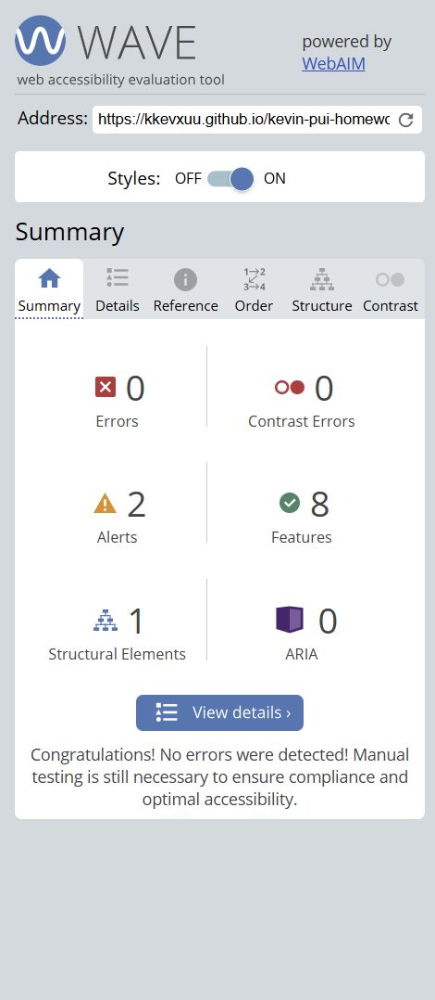
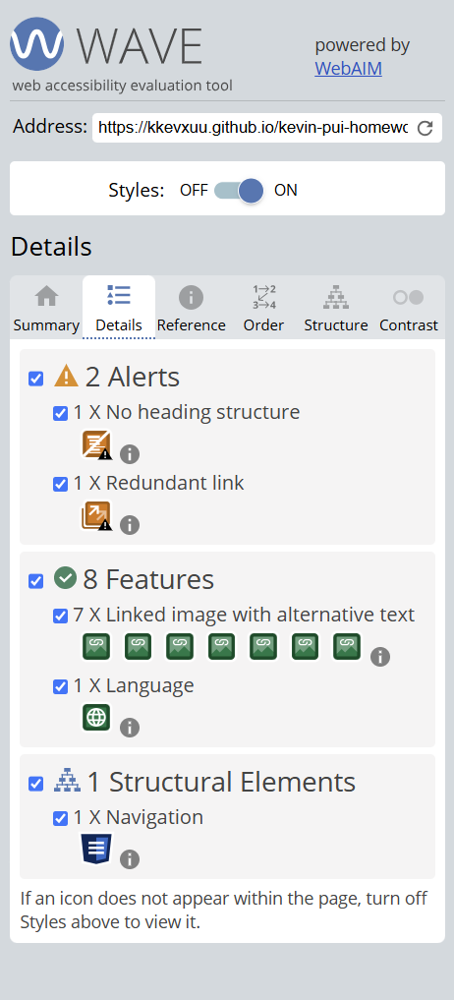
2. Project page
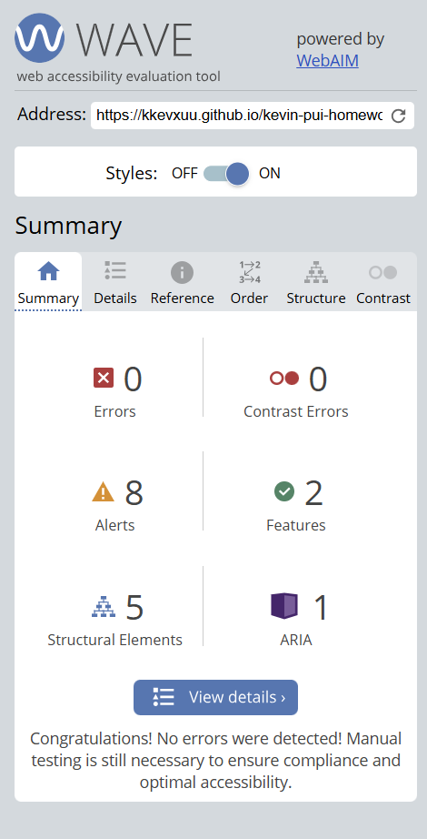
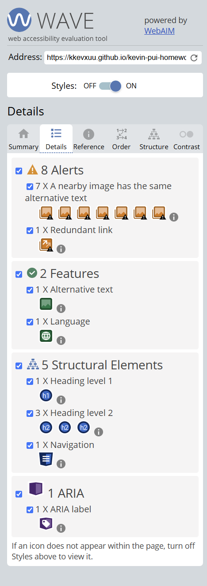
3. About page
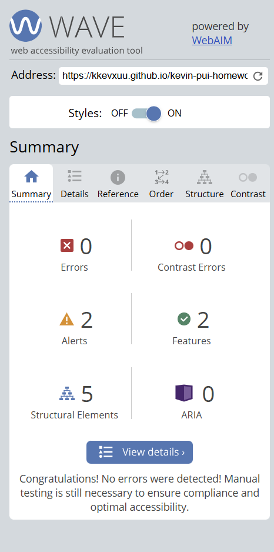
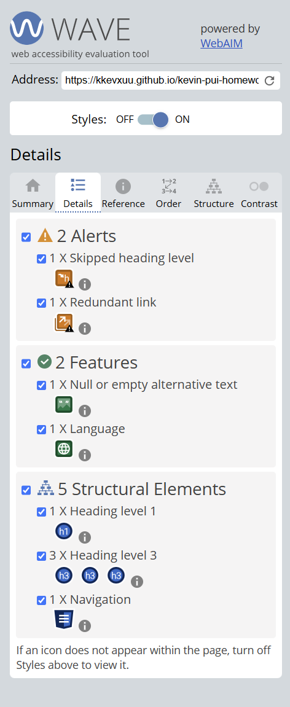

# **FP2 \- Evaluation of the Final project**

## Project Description

I plan to create a personal portfolio website featuring a horizontal scrolling parallax effect on the main navigation page, and also implement animations using libraries on my project pages. 

## High-Fi Prototypes

### *Prototype 1*

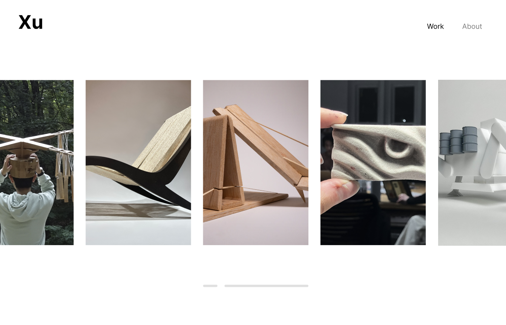

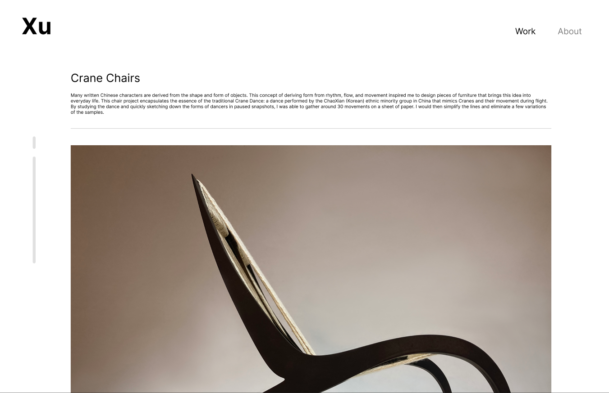

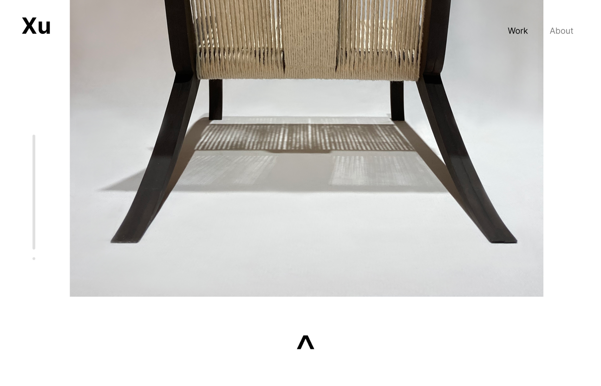

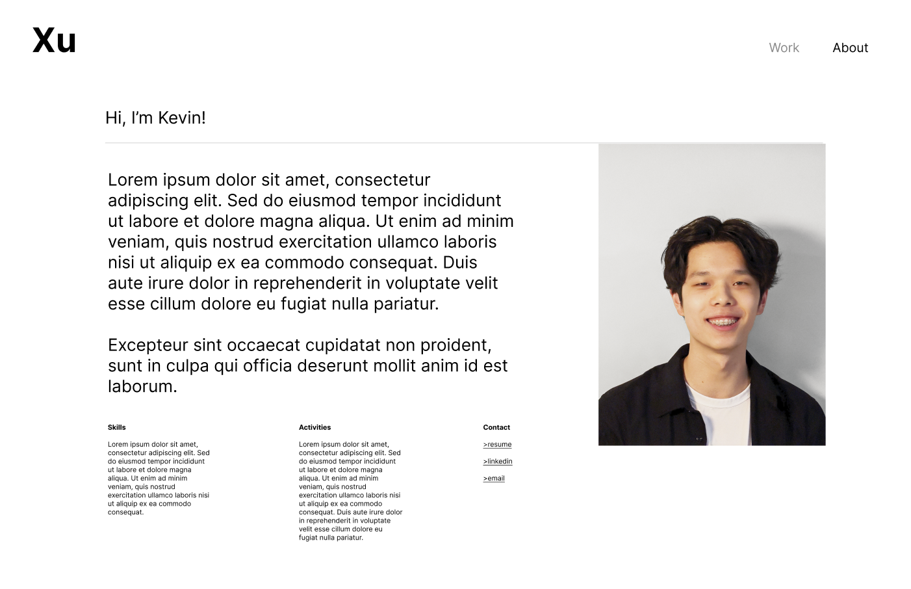

Testing procedure:

-How the test was conducted

The participants were given a task using the functional prototype. They were asked to use the site to view the chair project, check out the details, and then find the resume. They are then given 1 minute to freely explore the site and give suggestions on the fluidity of navigation. 

-What information was given to participant?

The participants were not given any information other than the above. They are to navigate the site purely based on visual cue and their innate logic. 

-What tasks did they perform?

Viewing project + finding resume

-What were the results?

Users reported a few things:

Organization of the mainpage was clear, but could use visual cue to locate themselves within the projects

The project page was tedious to scroll through, likely due to the length of the page. Make images smaller

They liked the persistent “Work” and “About” sections in the website, making it easy to navigate

Should add a back to top button at the end of each page
	
-Other general feedback?

User likes the simplicity and subtle features that enhance the UX, like clicking logo returns them to main page, and highlighting the “work” and “about” based on where you are located. They do think the website feels a bit static and could use more interactivity, which is understandable as this is still a prototype. 

### *Prototype 2*

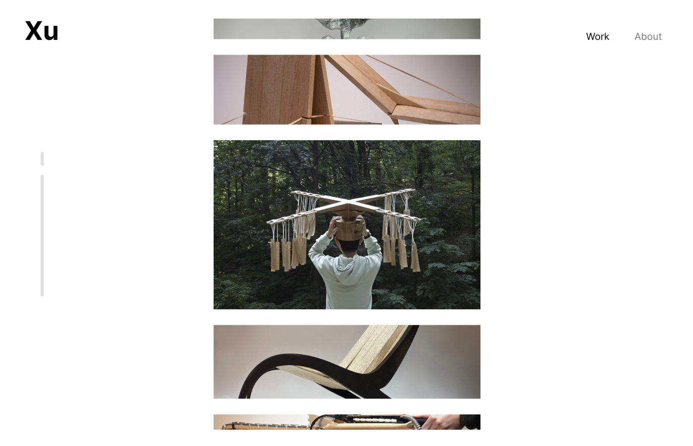

For prototype two, the same testing procedure was followed. The main page has a different design but the rest of the website was the same. Users commonly mentioned that the vertical scrolling was not as intriguing as the horizontal, and that if the progress bar for the horizontal bar was implemented, it would be as intuitive as a traditional vertical scrolling website. I decided to pursue prototype 1. 

## Usability Test

Based on user feedback, which was mostly about how more visual hints could be given to enhance the usability, I made a few changes:

Abandoned prototype 2 as the horizontal scroll feels quite intuitive based on their feedback, and this solution lacks uniqueness

Total length of pages reduced, pace of scrolling adjusted

Increased projects shown on main page to hint at scrolling as some are always partially concealed

Added dynamic progress bar that shows your position in a subtle way and makes website more interactive 

Added same progress bar to each individual project page

No changes made to profile "about" page, user liked straightforwardness of how the information was presented

## Updated Designs

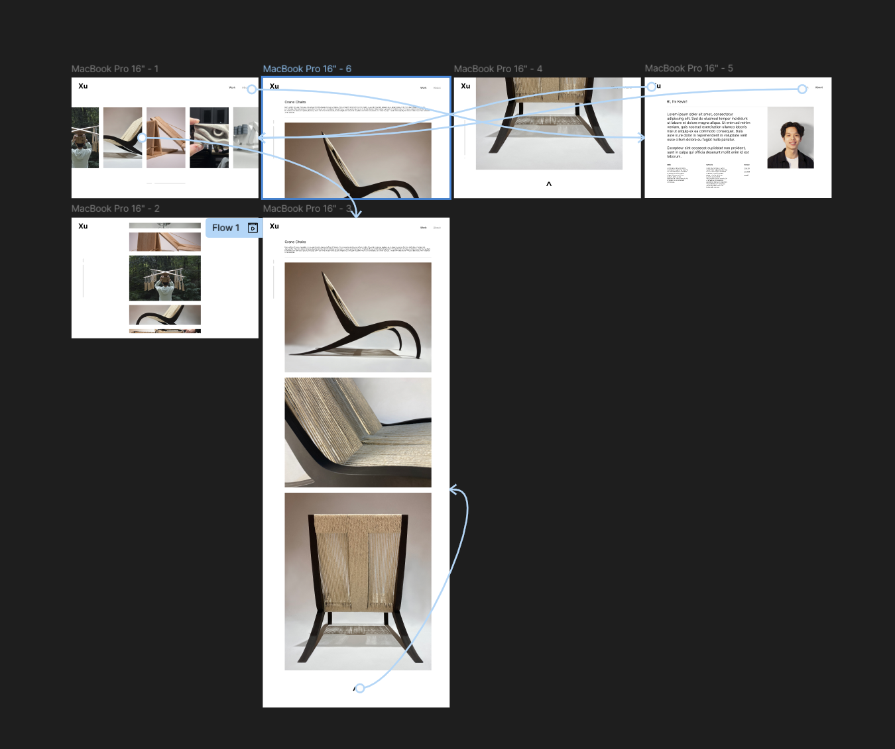

Improved user flow and reduced page length to make scrolling feel less tedious. The images shown previously of prototype 1 are of the updated design, with user suggestions already applied. 

## Feedback Summary

During lab, I received similar feedback to my user studies, which hinted that the things people brought up during the user testing were valid concerns. I think the biggest change that I made to my website based on all the feedback was the scroll bar - a simple design like the scrollbar added much more interactivity and usability to my website, as the user now has the ability to click and drag on the scroll bar - which is something they are more familiar with. When I implement unique features like horizontal scroll, it is important to remember that features like this are not what users are typically used to, and so it is important to include other indicators. Otherwise, in the lab session, the feedback for my project was mostly positive and I am excited to keep working. 

## Milestones

For the next 4 weeks, I have a structured plan to get this project completed.

Week 1:

Mostly research and deciding on which libraries to use. The horizontal scrolling can be done with many different libraries, or done in vanilla JS or vanilla CSS so there are tons of options to look into.

Week 2:

Completed the basic HTML and CSS website. I aim to have the MVP done at this time and begin to implement the basic animations using a library for the individual project pages.

Week 3:

Implement and mostly completed the website. At this stage, I aim to have users test the almost complete website to give me direction on what to work on next.

Week 4:

Website complete/polishing. For the last week I will be mostly working on polishing the website and making sure that the finished result has a completed and satisfying feel. Mostly adjusting font size, image size, and getting the website to work well on different screen sizes using media query. 

### *Implementation Plan*

- [X] Week 9 Oct 28 \- Nov 1:
  - [X] FP1 due
  - [X] Create prototypes and perform user testing
  
- [] Week 10 Nov 4 \- Nov 8:   
  - [X] FP2 due
  - [X] Begin research and starting the HTML/CSS

- [] Week 11 Nov 11 \- Nov 15:  
  - [] Complete the basic HTML and CSS website and work towards finishing MVP
  - [] Implement basic animations
  
- [] Week 12 Nov 18 \- Nov 22:   
  - [] Begin on finishing the parallax horizontal scrolling page
- [] Week 13 Nov 25 \- Nov 29:  
  - [] Continue to work on the website, aim to start polishing
  - [] Thanksgiving  
- [] Week 14 Dec 2 \- Dec 6:  
  - [] FP4 due 

### *Libraries and Other Components*

List the JS libraries and other components (if applicable) that you plan to use. 

Parallax.JS, GSAP, ScrollTrigger OR just vanilla JS/CSS for the main page, will decide based on performance 

MotionOne for animations

## Generative AI Use Plan

I will definitely be asking AI questions to along the way help with the implementation. I will mostly be sticking to asking questions for the purpose of explaining; ie "What does this code do" and "Why is X used instead of Y" type questions. I don't think I will be using code generated by AI though, as there are much better resources online like library documentations and youtube. I would much rather use those resources instead of AI, as AI always has the probability of making mistakes. 

### *Tool Use*

ChatGPT: for asking questions to help me understand code. Like mentioned before, I wil not be using code generated by ChatGPT, rather only using it to help me quickly understand something, the same way I would use a google search. 

### *Responsible Use*

How would you use Generative AI responsibly? 

I believe my use case is pretty responsible as I am not asking it to generate me code. If I ever find a solution with the help of AI, I will definitely cite it. However in my case that is pretty unlikely to happen. 

# **FP1 \- Proposal for Critique**

## Idea Sketches

### *Idea 1: 3D focused interactive portfolio*

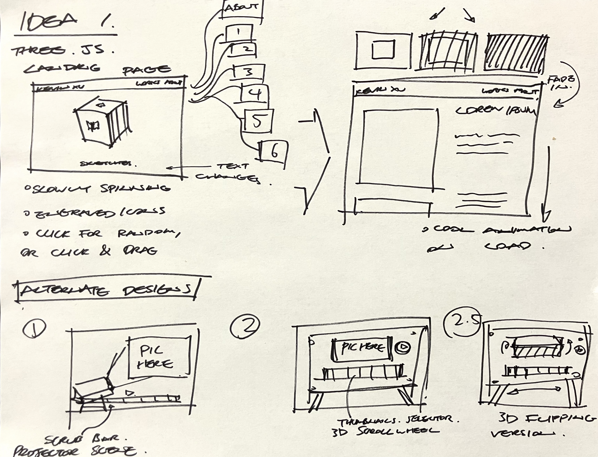

* Goal/basic idea description:

For my first idea, I would like to make a unique portfolio featuring a 3D model which the user can interact with to navigate to the different projects I created over the years. 3D elements are somewhat novel in web development, and I want to demonstrate my coding skills through this website to employers alongside my design work. 

* How it will be interactive/engaging: 

The 3D elements promote engagement and spark curiosity, making my website stand out from others. It also will showcase my work in a cool non-linear way, which I like. This 3D element will likely be on the main navigation page, and transitions with an animation into each project detail page. 

* Plans for accessibility:

I want my design to be bold and experimental while still being usable and accessible. I am a bit concerned about this complex website eorking on different platforms, especially how the website would work on a mobile device, being primarily designed for viewing on a computer. I will try to look for libraries that are compatiable. 

* Tools:
Three.JS
Solidworks or Blender for the CAD model
Javascript/CSS/HTML

### *Idea 2: animation focused interactive portfolio*

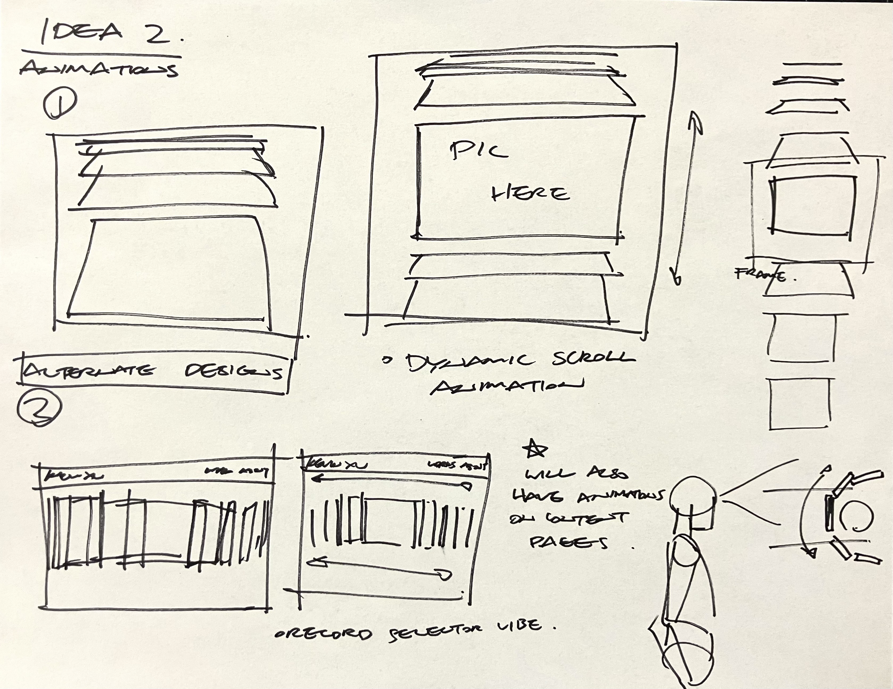

* Goal/basic idea description:

I would also like to try creating a website built around unique animations and parallax scrolling, vertical or horizontal. I'm intrigued by unique interactions this could bring, as websites are commonly 2D and vertical scrolling. Parallax effect can add depth and horizontal scrolling of my main page can be something that the user discovers naturally. I also want to try to support clicking and dragging the images to navigate, for a more realistic and tactile feel. 

* How it will be interactive/engaging: 

Besides the unique navigation page, for my content pages, I want to incorporate a unique cursor that interacts with the content and also cool animated loading effects. These are secondary goals, however. The main focus is on building a navigation that prioritizes UX, and feels tactile and three-timensional. 

* Plans for accessibility:
There is a possibility that I will make an alternative vertical scrolling website for mobile interfaces using media queries.

* Tools:
GSAP/Parallax.JS/Motion One
Javascipt/CSS/HTML

### *Idea 3: generative tree refresh/website landing page*

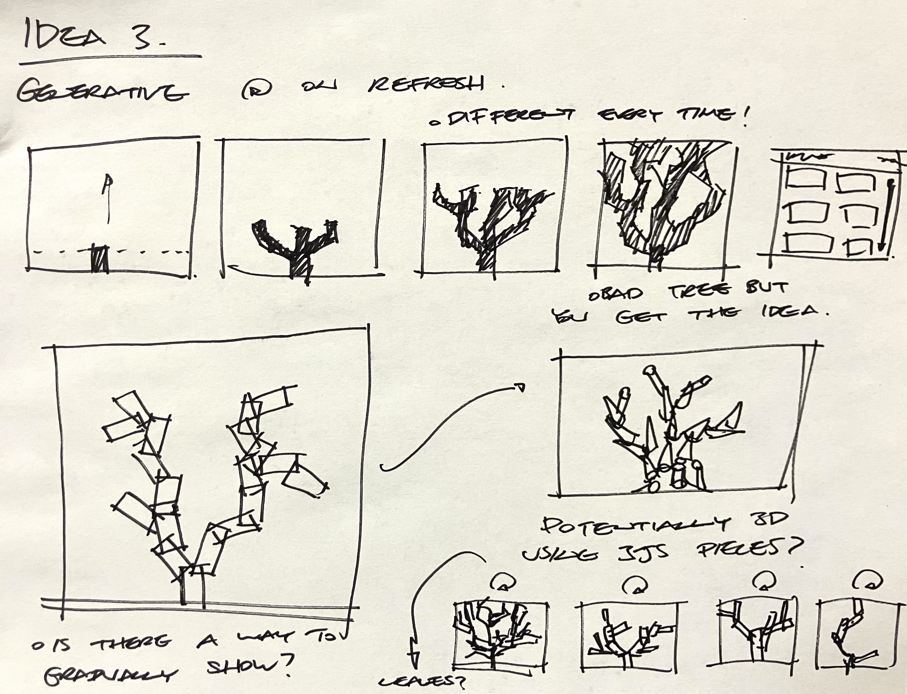

* Goal/basic idea description:

I want to create a landing page or refresh screen for my portfolio that is intriguing to interact with. It will have the ability to generate a new tree structure on every refresh, or when a certain button is clicked, to give a sense of an experience that is unique to every visitor of my website. I can stimulate the "generation" by revealing the finished structure slowly, like a fake loading screen. 

* How it will be interactive/engaging: 

The tree structure will be different every time it is generated. I will look into the generation of random tree structures and perhaps impleent it through 2D geometric elements, or use Three.JS if it is not too diffficult. 

* Plans for accessibility:

I have never written generative code, so that is what I'm mostly concerned about. This feature will not affect the usability or accessibility of my other webpages as it is merely a landing page, but I will be sure to implement it for different browser sizes. 

* Tools:
Three.JS
Javascript/CSS/HTML

## Feedback Summary

Summarize all the critiques you received during the lab session (\~300 words). 

1. Acheive the basics. I should aim to acheive a MVP or minimum viable product first, and then implement other features if I have time.  I need to identify the must-have features of my website, and the "good-to-haves". 

2. Vertical scrolling. People generally preferred my second idea with the horizontal parallax scrolling on the main page, however they preferred a vertical scrolling orientation for the project detail page. 

3. Accessibility. Keyboard accessibility was brought up for the second idea, not only should people be able to scroll with a mouse or trackpad, but it needs to work with the up-down-left-right arrow keys as well. 

4. Hints. A visual cue or suggestion such as a progress bar could be added to my horizontal scroll navigation page, to give people a hint of the website being horizonal scroll.

5. Infinite scrolling. I can fully embrace the uniqueness of the horizontal scroll if I made it loop and endless, so that instead of scrolling back to where they were, they can continue scrolling and see the same projects again. 

6. More interactions. My projects can become slightly bigger when they are "selected" as users pan through my navigation. This will add a level of assurance and make the interface feel more responsive and interactive. 

## Feedback Digestion

Digest the feedback you got in the lab (\~300 words). Indicate which critique you will act on in your next design and why you chose to incorporate/dismiss pieces of critique.

The feedback session was extremely helpful. People brought up valuable suggestions and ideas that I would not have considered otherwise, and I am so grateful to now have a clear direction of where I'm headed, and what to keep in mind! I have decided to go with my second idea, of creating a personal portfolio website with an animation focus. It will have a horizontal parallax scroll navigation page, and project description pages with subtle animations. 

I think all the critique I received was valid, and I will try to incorporate all of them, time permitting. My favorite pieces of advice were to acheive a MVP first, so that I am not stuck obsessing over a certain feature and neglecting to make progress on my overall project, and also to include a progress bar in the navigation page to hint at the horizontal scrolling. I believe that subtle details and hints like the progress bar are what make the UX experience so seamless and special, and very glad that this is brought to my attention as I forgot to consider it entirely! I will be sure to get more feedback after my prototype is created, and continue to improve the UX experience. Having a unique feature like horizontal scroll is making me very excited about all the associated possibilities and novel UX solutions I will need to come up with. 

